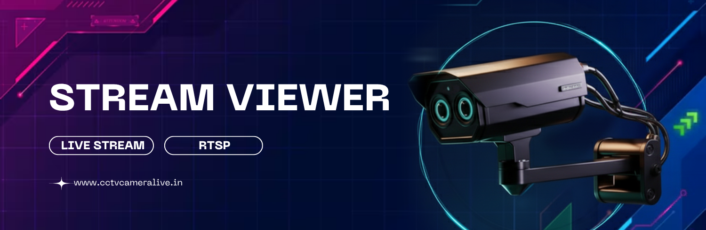

# 📹 StreamVision

**StreamVision** is a Node.js-based real-time DVR camera streaming platform that allows users to stream multiple RTSP camera feeds directly in the browser. It's now fully containerized with Docker, making deployment easier than ever. It supports dynamic DVR configurations, lazy loading of streams, and a responsive public viewer page.

---

## ✨ Features

- 🔒 Dynamic DVR login with username/password/IP
- 🐳 **Containerized Deployment:** Run the entire application with a single command using Docker Compose. No need to install FFmpeg or manage dependencies manually.
- 💨 Stream up to 16 RTSP camera channels per DVR
- ⚙️ FFmpeg-based RTSP to HLS conversion (one worker per DVR)
- 🌐 Public view for each DVR's live streams
- 🧠 Lazy loading of video players using Intersection Observer
- 🖥️ EJS templating with Tailwind CSS
- 📁 Organized and scalable architecture (routes, controllers, workers, views)

---

## 🛠 Tech Stack

- **Backend:** Node.js, Express
- **Frontend:** EJS, Tailwind CSS, HLS.js
- **Streaming Engine:** FFmpeg (Containerized, RTSP → HLS)
- **Database:** MySQL (for DVRs, Cameras, Locations)
- **Containerization:** Docker, Docker Compose
- **Worker Management:** `worker_threads` (Node.js)

---

## 📁 Project Structure

```bash
StreamVision/
├── app.js                 # Main Express server
├── Dockerfile             # Instructions to build the application's Docker image
├── docker-compose.yaml    # Defines the multi-container Docker application
├── ecosystem.config.js    # PM2 process manager configuration
├── package.json           # Project metadata and dependencies
├── README.md              # Project documentation
├── tailwind.config.js     # Tailwind CSS configuration
├── .env.example           # Example environment variables
├── .gitignore             # Git ignore rules
├── config/                # Configuration files
├── controllers/           # Business logic
├── database/              # Database-related files
│   └── structure.sql      # SQL script for database structure
├── models/                # Data models
├── public/                # Static assets and stream outputs
├── routes/                # Express route definitions
├── services/              # Service logic
├── src/                   # Source files for CSS
├── utils/                 # Utility functions
└── views/                 # EJS templates
```

---

## 🚀 Getting Started with Docker (Recommended)

### Prerequisites

- Docker
- Docker Compose

### 1\. Clone the Repository

```bash
git clone https://github.com/your-username/StreamVision.git
cd StreamVision
```

### 2\. Configure Environment

Create a `.env` file by copying the example file:

```bash
cp .env.example .env
```

Now, open the `.env` file and fill in your configuration details, especially the database credentials.

```ini
# Server Configuration
PORT=3000
NODE_ENV=production

# Database Configuration
DB_HOST=host.docker.internal # Or your DB's IP address
DB_USER=root
DB_PASSWORD=yourpassword
DB_DATABASE=streamvision
DB_PORT=3306

# JWT Configuration
jwt_token=your_jwt_secret

# Password Hashing
saltRounds=10

# SSL Configuration (Optional)
DB_CA=/path/to/your/server-cert.pem
```

### 3\. Database Setup

Ensure your MySQL server is running and accessible from the Docker container. Import the database structure using the provided SQL file:

```bash
# Example using MySQL CLI
mysql -u your_user -p your_database < database/structure.sql
```

### 4\. Build and Run the Container

Use Docker Compose to build the image and start the container in the background.

```bash
docker-compose up --build -d
```

The application will now be running on the port you specified in your `.env` file (e.g., `http://localhost:3000`).

### Managing the Container

- **View logs:** `docker-compose logs -f`
- **Stop the container:** `docker-compose down`

---

## ⚙️ Manual Installation (Without Docker)

### Prerequisites

- Node.js (v14+ recommended)
- MySQL database
- **FFmpeg** installed on your system PATH

### 1\. Install Dependencies

```bash
npm install
```

### 2\. Configure Environment

Create a `.env` file as described in the Docker setup, ensuring `DB_HOST` is set to `localhost` or your database IP.

### 3\. Build CSS

```bash
npm run build:css
```

### 4\. Run the Application

**Development Mode (with auto-reload):**

```bash
npm run dev
```

**Production Mode:**

```bash
# Start with Node
npm start

# Or start with PM2 for process management
npm run start:pm2
```

---

## 🛠 Available Scripts

| Command               | Description                                       |
| --------------------- | ------------------------------------------------- |
| `npm start`           | Starts the production server using `node`.        |
| `npm run dev`         | Starts the development server with nodemon.       |
| `npm run build:css`   | Builds and minifies CSS using Tailwind.           |
| `npm run start:pm2`   | Starts the app using the PM2 process manager.     |
| `npm run setup:linux` | Installs required dependencies for Debian/Ubuntu. |

---

## 📦 Dependencies

### Core Dependencies

- Express.js
- MySQL2
- FFmpeg-fluent
- Tailwind CSS
- Hls.js
- JWT for authentication
- Bcrypt for password hashing

### Development Dependencies

- Nodemon
- Express Status Monitor

---

## 📄 License

ISC © Amrit

---

## 🙏 Acknowledgments

- FFmpeg team for powerful media processing
- Hls.js for excellent player implementation
- Tailwind CSS for utility-first styling
