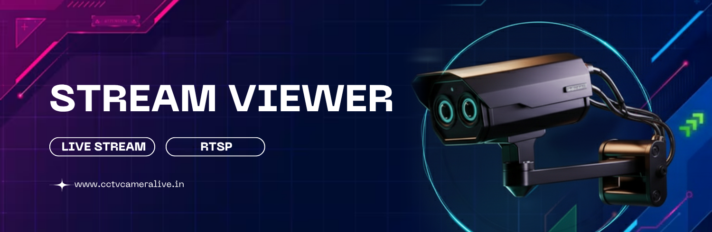

# 📹 StreamVision

**StreamVision** is a Node.js-based real-time DVR camera streaming platform that allows users to stream multiple RTSP camera feeds directly in the browser. It's now fully containerized with Docker, making deployment easier than ever. It supports dynamic DVR configurations, lazy loading of streams, and a responsive public viewer page.

---

## ✨ Features

- 🔒 **Secure Access:** Multi-layered security with JWT authentication, Bcrypt password hashing, and CSRF protection.
- 🐳 **Containerized Deployment:** Fully Dockerized setup for effortless deployment including automatic FFmpeg handling and Nginx reverse proxy.
- 💨 **High-Performance Streaming:** Sub-second latency RTSP to HLS conversion using a scalable Cluster-based process model.
- 🖥️ **Centralized Dashboard:** Manage multiple DVRs and up to 16 RTSP camera channels per DVR from a single interface.
- 📊 **Real-time Analytics:** Track stream usage, active sessions, and system performance with built-in analytics.
- 📁 **Automated Reporting:** Generate professional PDF reports for system activity and camera health using `pdfkit`.
- 🌐 **Public Streaming:** Dedicated public viewing URLs for simplified stream sharing with optimized Hls.js playback.
- 🧠 **Resource Efficiency:** Lazy loading of video players and automatic stream cleanup after inactivity.
- 🎨 **Modern UI:** Responsive design built with EJS, Tailwind CSS v4, and Flowbite components.

---

## 🛠 Tech Stack

- **Backend:** Node.js, Express.js (v5.x), Cluster API
- **Frontend:** EJS (Embedded JavaScript), Tailwind CSS v4, Flowbite, Hls.js
- **Media Engine:** FFmpeg (RTSP → HLS conversion)
- **Database:** MySQL 8.0+ (using `mysql2/promise`)
- **Security:** CSRF-CSRF (Double-Submit Cookie), JWT, Bcrypt
- **Monitoring:** Prometheus, Loki (via `monitoringClient.js`)
- **Deployment:** Docker, Docker Compose, Nginx

---

## 🏗 System Architecture

The StreamVision architecture is designed for high-performance RTSP to HLS conversion with minimal latency, utilizing Node.js's scalability features.

1.  **Workflow Model:** The application uses a **Master-Worker process model** (Node.js `cluster` module).
    - **Master Process:** Manages the lifecycle of workers and provides IPC (Inter-Process Communication) handlers to start/stop streams.
    - **Worker Processes:** Run the Express.js application, handling HTTP requests and serving the UI/API.
2.  **Ingestion:** The system receives raw RTSP streams from DVRs or IP Cameras via TCP (configured in `ffmpeg` flags for reliability).
3.  **Processing:** When a stream is requested, the Master process spawns a dedicated **FFmpeg process**. This process is managed by `worker_threads` and `child_process.spawn`.
4.  **Segmentation:** FFmpeg converts the RTSP input into **HLS (.m3u8)** playlists and **MPEG-TS (.ts)** segments.
    - Segments are 1-second long for near real-time latency.
    - Stale segments are automatically cleaned up to save disk space.
5.  **Delivery:** HLS segments are served via Express static middleware (or Nginx in production) and played back using **Hls.js** on the frontend.

---

## 📁 Project Structure

```bash
StreamVision/
├── app.js                 # Express server & middleware configuration
├── cluster.js             # Master process (Cluster management & IPC)
├── Dockerfile             # Docker image definition
├── docker-compose.yaml    # Multi-container orchestration (App & Nginx)
├── .env.example           # Environment variables template
├── config/
│   └── db.js              # MySQL connection (mysql2/promise)
├── controllers/           # Business logic for each feature
│   ├── analyticsController.js   # Usage tracking & stats
│   ├── camerasController.js     # Camera CRUD & config
│   ├── dvrController.js         # DVR management
│   ├── publicStreamController.js # Public viewing logic
│   └── settingsController.js    # App settings management
├── routes/                # Express route definitions
│   ├── api/               # Backend API endpoints
│   ├── cameraRoutes.js    # Camera management UI routes
│   ├── userRouters.js     # Auth & Profile routes
│   └── publicRoutes.js    # Public viewing & streaming routes
├── services/              # Core background services
│   ├── auth.js            # JWT & Bcrypt logic
│   ├── rtspHealth.service.js    # Stream health monitoring
│   └── rtspMetadata.service.js  # Metadata extraction from RTSP
├── utils/                 # Shared utility functions
│   ├── streamStore.js     # Master stream management (spawn FFmpeg)
│   ├── activityLogger.js  # Audit logs for system actions
│   ├── reportGenerator.js # PDF report creation (pdfkit)
│   └── logger.js          # Winston-based logging
├── views/                 # EJS Templates
│   ├── partials/          # Reusable UI components (Navbar, Sidebar)
│   ├── dashboard.ejs      # Main admin overview
│   └── camera.ejs         # Individual camera viewing
├── public/                # Static assets
│   ├── css/               # Compiled Tailwind CSS
│   └── streams/           # Active HLS segments (temporary)
└── database/
    └── structure.sql      # Initial database schema
```

---

## 🚀 Getting Started with Docker (Recommended)

### Prerequisites

- Docker
- Docker Compose

### 1. Clone the Repository

```bash
git clone https://github.com/CodeByAmrit/StreamVision.git
cd StreamVision
```

### 2. Configure Environment

This project supports the encrypted `.env.vault` workflow from dotenv.org. You can still use `.env.example` locally, but for production the recommended flow is to pull the runtime `.env` file from the vault.

#### Local development

If you want a plain `.env` sample file, copy the example:

```bash
cp .env.example .env
```

Alternatively, pull the development values directly from vault:

```bash
npx dotenv-vault pull development .env -y
```

#### Production / VPS deployment

Keep `.env.vault` in the repository. On the VPS, generate the runtime file before you start Docker:

```bash
cd /path/to/StreamVision
npx dotenv-vault pull production .env -y
```

If you cannot run `dotenv-vault login` on the server, provide the decrypt credential via `DOTENV_ME`:

```bash
export DOTENV_ME="your_dotenv_me_token"
npx dotenv-vault pull production .env -y
```

Open `.env` and fill in your configuration if you created it manually from `.env.example`.

| Variable                   | Description                     | Example                    |
| :------------------------- | :------------------------------ | :------------------------- |
| `NODE_ENV`                 | Environment mode                | `production`               |
| `PORT`                     | Web server port                 | `3000`                     |
| `DB_HOST`                  | MySQL hostname                  | `localhost`                |
| `DB_PORT`                  | MySQL port                      | `3306`                     |
| `DB_USER`                  | MySQL username                  | `root`                     |
| `DB_PASSWORD`              | MySQL password                  | `******`                   |
| `DB_DATABASE`              | MySQL database name             | `streamvision`             |
| `DB_CA`                    | MySQL SSL CA (base64 string)    | `<base64 certificate>`     |
| `jwt_token`                | Secret for auth tokens          | `secure_token_here`        |
| `saltRounds`               | Bcrypt work factor              | `12`                       |
| `STREAM_AUTO_STOP_MINUTES` | Auto-stop duration in minutes   | `120`                      |
| `PROMETHEUS_URL`           | Prometheus endpoint             | `http://prometheus:9090`   |
| `PROMETHEUS_USER`          | Prometheus basic auth user      | `user`                     |
| `PROMETHEUS_PASS`          | Prometheus basic auth password  | `pass`                     |
| `LOKI_URL`                 | Loki endpoint                   | `http://loki:3100`         |
| `LOKI_USER`                | Loki basic auth user            | `user`                     |
| `LOKI_PASS`                | Loki basic auth password        | `pass`                     |

---

## 🚀 API Documentation

The platform provides several internal and public API endpoints for stream management.

### Public Endpoints (No Auth)

- `GET /api/public/camera/:id/hls`: Returns the active HLS URL for a specific camera.
- `GET /public/dvr/:id`: Direct link to the public viewing dashboard for a DVR.

### Protected Endpoints (Auth Required)

- `POST /api/start-stream`: Starts an RTSP to HLS conversion session.
  - **Body:** `{ "rtspUrl": "rtsp://..." }`
- `POST /api/stop-stream`: Manually terminates a stream session.
  - **Body:** `{ "rtspUrl": "rtsp://..." }`

---

## 📊 Monitoring & Logging

StreamVision includes an integrated monitoring client for enterprise-grade observability.

- **Metrics:** Built-in Prometheus metrics exporter.
- **Log Aggregation:** Ready-to-use Grafana Loki integration for centralized log search.
- **Audit Logs:** Every camera/DVR state change is recorded with user attribution in `utils/activityLogger.js`.

---

## 📁 PDF Report Generation

Located in `utils/reportGenerator.js`, this utility allows for generating detailed PDF reports containing:

- Camera uptime and health status.
- System activity and security events.
- Customizable location-based summary statistics.

### 3\. Database Setup

Ensure your MySQL server is running and accessible from the Docker container. Import the database structure using the provided SQL file:

```bash
# Example using MySQL CLI
mysql -u your_user -p your_database < database/structure.sql
```

### 4\. Build and Run the Container

Use Docker Compose to build the image and start the container in the background.

```bash
docker-compose up --build -d
```

The application will now be running on the port you specified in your `.env` file (e.g., `http://localhost:3000`).

### Dokploy / VPS Deployment Checklist

Use this flow when your Docker image is built in GitHub Actions and your VPS or Dokploy deployment only needs runtime configuration.

1. SSH into the VPS and change to the project directory:
   ```bash
   cd /path/to/StreamVision
   ```
2. Make sure `.env.vault` is present in the repository.
3. If you use vault credentials instead of logging in interactively, export `DOTENV_ME`:
   ```bash
   export DOTENV_ME="your_dotenv_me_token"
   ```
4. Pull the production env file from dotenv-vault:
   ```bash
   npx dotenv-vault pull production .env -y
   ```
5. Start the container stack using Docker Compose:
   ```bash
   docker compose up -d
   ```
   If Dokploy uses the image that GitHub Actions already pushed, this command will use the existing image and the new runtime `.env` values.
6. Check logs and confirm the app started successfully:
   ```bash
   docker compose logs -f streamvision_app
   ```

> Important: Do not commit `.env` into git. Keep only `.env.vault` in version control.

#### If Dokploy injects environment variables directly

If your production deployment platform can provide runtime env vars without `.env`, ensure it supplies the same values listed in `.env.example`.

- `NODE_ENV=production`
- `PORT`
- `DB_HOST`
- `DB_PORT`
- `DB_USER`
- `DB_PASSWORD`
- `DB_DATABASE`
- `DB_CA` (base64-encoded cert for production MySQL SSL)
- `jwt_token`
- `saltRounds`
- `STREAM_AUTO_STOP_MINUTES`
- optional: `PROMETHEUS_URL`, `PROMETHEUS_USER`, `PROMETHEUS_PASS`, `LOKI_URL`, `LOKI_USER`, `LOKI_PASS`

### Managing the Container

- **View logs:** `docker-compose logs -f`
- **Stop the container:** `docker-compose down`

---

## ⚙️ Manual Installation (Without Docker)

### Prerequisites

- Node.js (v14+ recommended)
- MySQL database
- **FFmpeg** installed on your system PATH

### 1\. Install Dependencies

```bash
npm install
```

### 2\. Configure Environment

Create a `.env` file as described in the Docker setup, ensuring `DB_HOST` is set to `localhost` or your database IP.

### 3\. Build CSS

```bash
npm run build:css
```

### 4\. Run the Application

**Development Mode (with auto-reload):**

```bash
npm run dev
```

**Production Mode:**

```bash
# Start with Node
npm start

# Or start with PM2 for process management
npm run start:pm2
```

---

## 🛠 Available Scripts

| Command               | Description                                       |
| --------------------- | ------------------------------------------------- |
| `npm start`           | Starts the production server using `node`.        |
| `npm run dev`         | Starts the development server with nodemon.       |
| `npm run build:css`   | Builds and minifies CSS using Tailwind.           |
| `npm run start:pm2`   | Starts the app using the PM2 process manager.     |
| `npm run setup:linux` | Installs required dependencies for Debian/Ubuntu. |

---

## 📦 Dependencies

### Core Dependencies

- Express.js
- MySQL2
- FFmpeg-fluent
- Tailwind CSS
- Hls.js
- JWT for authentication
- Bcrypt for password hashing

### Development Dependencies

- Nodemon
- Express Status Monitor

---

## 🔧 Troubleshooting & FAQ

### **RTSP Stream Not Loading?**

- Ensure FFmpeg is installed and in your system `PATH`.
- Verify the RTSP URL is accessible from your server (try `ffplay rtsp://your_url`).
- Check Docker logs: `docker-compose logs -f streamvision_app`.
- Verify database camera configuration (RTSP URL, port, credentials).

### **HLS Performance Tuning**

- Segments are 1-second long by default for low latency. If buffering occurs, adjust `-hls_time` in `utils/streamStore.js`.
- Adjust `UV_THREADPOOL_SIZE` in `cluster.js` if file I/O becomes a bottleneck.

---

## 📄 License

ISC © Amrit

---

## 🙏 Acknowledgments

- FFmpeg team for powerful media processing
- Hls.js for excellent player implementation
- Tailwind CSS & Flowbite for modern styling
